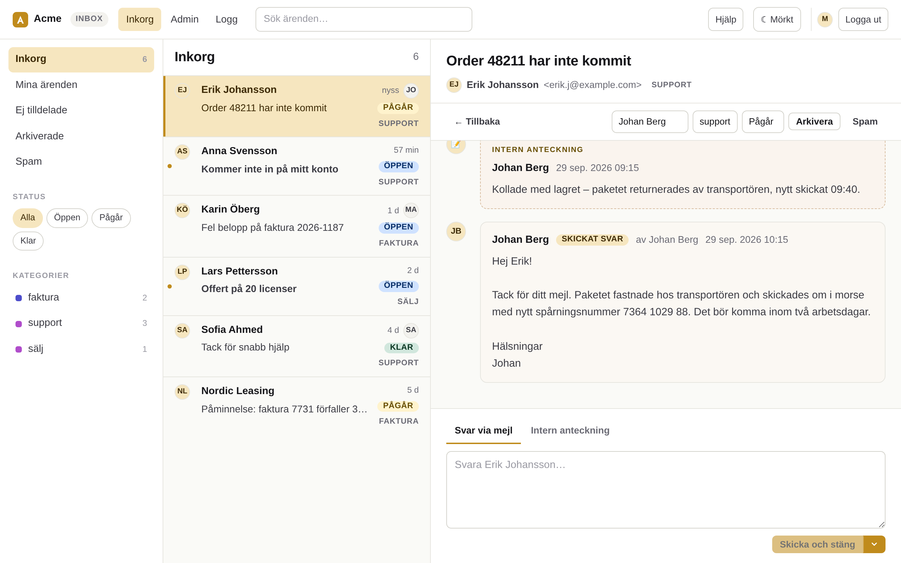
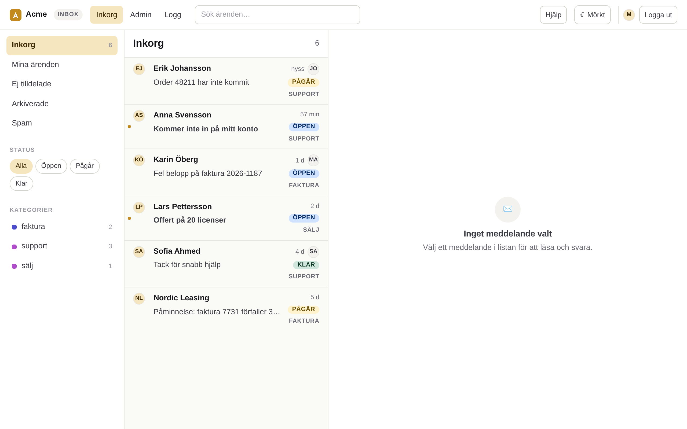
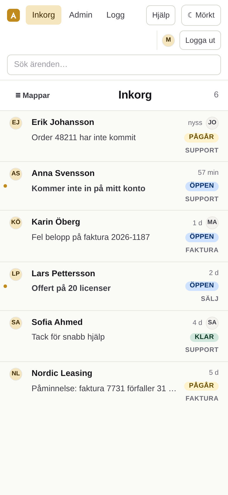
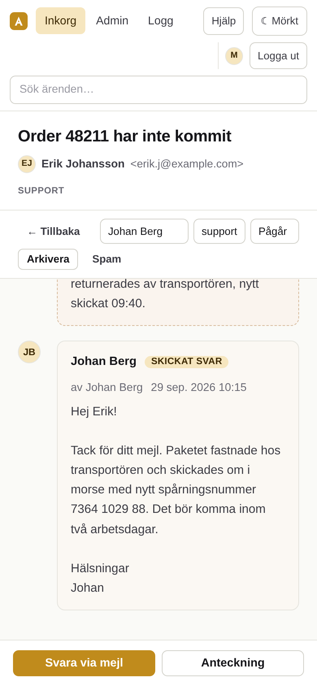

# License

BSD 2-Clause "Simplified" License (the FreeBSD license), Copyright (c) 2026
Puls Solutions AB. Full text in [LICENSE](LICENSE).

# inbox

A shared email support inbox, deployable per company from one config file.
Mail arrives at your domain, becomes a ticket, agents read and reply from a web
app, and replies thread back onto the same ticket.

<p align="center">
  
</p>

## How it works

```
someone@anywhere → support@yourdomain
  └─ MX → SES receiving
       └─ S3 (raw MIME, the only copy of the body)
            └─ parse Lambda → DynamoDB ticket row
                 └─ agent web app → reply via SES, threaded
```

The recipient's local part becomes the ticket's **category**, so adding a queue
(`billing@`, `sales@`) is an email alias, not a deploy. The recipient's domain
selects the **tenant**, so one deployment can serve several brands.

## What agents see

Folders and filters on the left, the ticket list in the middle, the open
ticket on the right. Replies go out from the category's address; internal
notes stay in the thread. There is a built-in Swedish user manual under
`Hjälp` in the app header (`aws/web/inbox/manual.html`).

<p align="center">
  
</p>
<p align="center">
  
  
</p>

## One deployment = one AWS account

Forced, not preferred: only one SES receipt rule set can be active per account
per region, so a second deployment in the same account would silently stop the
first one receiving mail.

## Deploying

Everything comes from one profile in `deployments/`:

```bash
node scripts/profile.mjs <profile> --check     # validate
node scripts/deploy.mjs  <profile> --dry-run   # see what would happen
node scripts/deploy.mjs  <profile>             # deploy, in dependency order
```

The deploy script refuses to run against an account the profile does not name.

New deployment? Start at `docs/bootstrap.md`.

## Layout

| Path                         | What                                                                       |
| ---------------------------- | -------------------------------------------------------------------------- |
| `deployments/`               | One JSON file per deployment. The only place company-specific values live. |
| `scripts/`                   | `profile.mjs` (validate + derive), `deploy.mjs` (orchestrate)              |
| `aws/account`, `aws/billing` | One-time account bootstrap                                                 |
| `aws/shared`                 | Build artifact bucket                                                      |
| `aws/services/inbox`         | HTTP API, Cognito, the reminder sweep                                      |
| `aws/services/inbox-parse`   | Inbound parse Lambda (inline in its template)                              |
| `aws/services/inbox-mail`    | SES receipt rule and raw-mail bucket                                       |
| `aws/web/inbox`              | Vue 3 agent app                                                            |
| `docs/`                      | Architecture, bootstrap, DNS, email, deployment, cost, security, decisions |

## Running it locally

No AWS needed - the service runs against in-memory fakes and the web app
against it. See `docs/local-development.md`.

## Tests

```bash
node --test test/*.test.mjs                                  # profile expansion
cd aws/services/inbox && npm test && npm run test:integration
cd aws/web/inbox && yarn test
```
